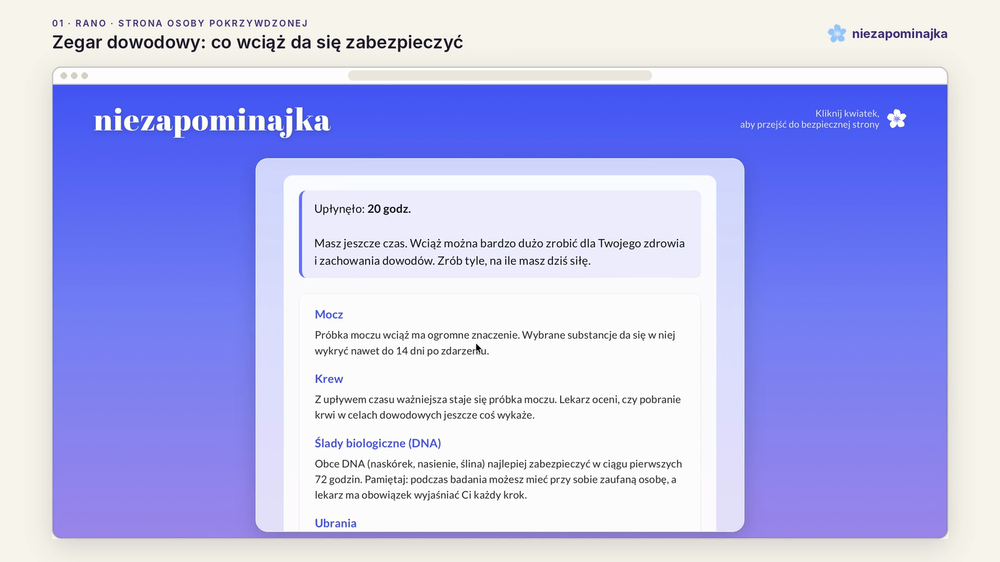
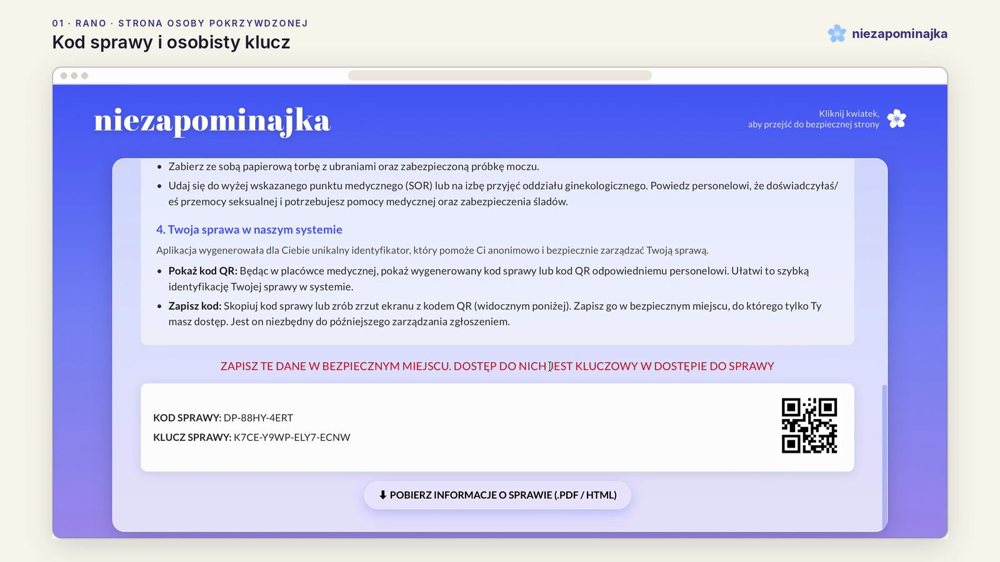
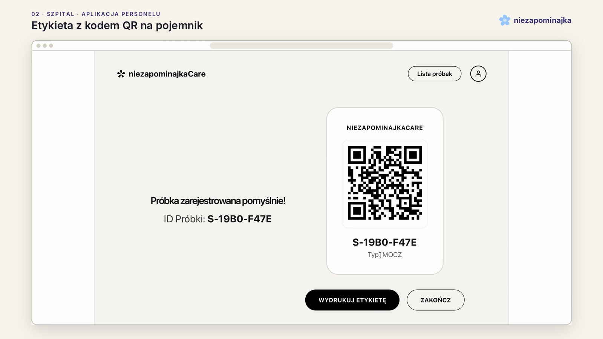
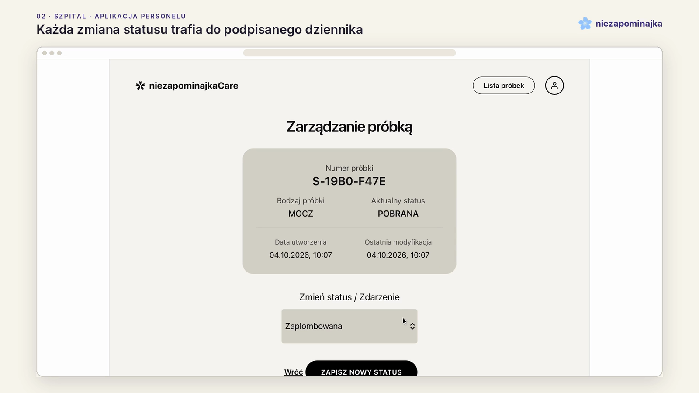
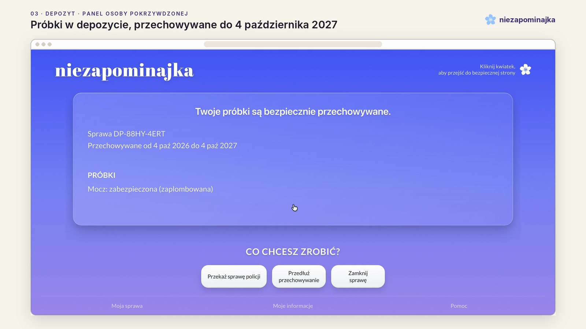
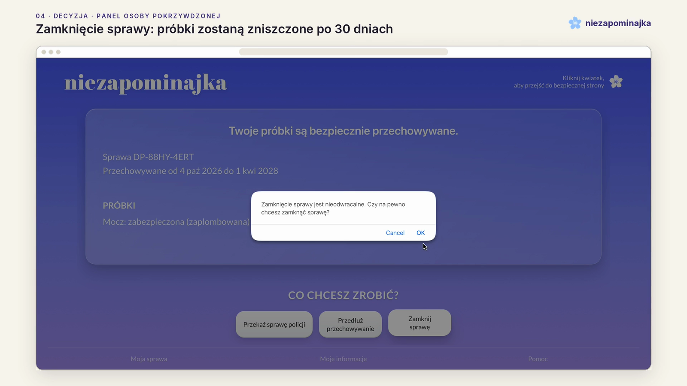
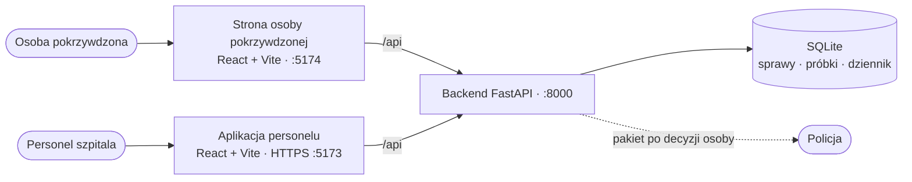

<p align="center">
  
</p>

# Niezapominajka

**Zabezpiecz dowody teraz. O zgłoszeniu zdecyduj później.**

Niezapominajka to system, który pozwala zabezpieczyć dowody po przemocy seksualnej w szpitalu bez zgłaszania sprawy na policję. Próbki czekają w depozycie nietestowane, a o przekazaniu ich policji decyduje wyłącznie osoba pokrzywdzona, swoim osobistym kluczem. Projekt powstał w czasie **HackYeah 2026** w zespole **MeowDevs**.

[Prezentacja (PDF)](docs/niezapominajka_prezentacja.pdf) · [Architektura](docs/architektura.md) · [Model zagrożeń](docs/model-zagrozen.md) · [Research prawny](docs/research-prawny.md)

> [!IMPORTANT]
> Prototyp z hackathonu. Wszystkie sprawy, próbki i szpitale w aplikacji są fikcyjne. Projekt nie jest wdrożony w żadnej placówce i nie zastępuje porady lekarskiej ani prawnej.

## Problem

Dowody po przemocy seksualnej znikają w ciągu godzin. Według policji substancja nazywana pigułką gwałtu znika z krwi po 8 godzinach, a po 12 nie da się jej wykryć nawet w moczu. Te same substancje mogą odebrać pamięć zdarzenia, więc zanim ktoś zrozumie, co się stało, części śladów już nie ma.

W Polsce zabezpieczenie dowodów wiąże się w praktyce ze zgłoszeniem sprawy na policję:

- bez zgłoszenia próbki często nie zostają nawet pobrane,
- decyzję trzeba więc podjąć od razu, w szoku i pod presją czasu,
- tymczasem w badaniu Fundacji STER z 2016 roku **94,1%** przypadków przemocy seksualnej, których doświadczyły badane kobiety, nie zostało zgłoszonych na policję.

Szkocja rozdzieliła te decyzje. Od 1 kwietnia 2022 roku osoby od 16. roku życia mogą zabezpieczyć dowody bez udziału policji, a próbki są przechowywane przez 26 miesięcy i nie są badane, dopóki sprawa nie zostanie zgłoszona. W Szwecji zaleca się przechowywanie zabezpieczonych śladów przez dwa lata.

## Kluczowe funkcje

1. **Strona bez konta.** Osoba pokrzywdzona nie podaje imienia, maila ani numeru telefonu. Do sprawy wchodzi się wyłącznie kodem sprawy i osobistym kluczem.
2. **Uczciwa informacja o poufności.** Zanim cokolwiek się zacznie, strona mówi, w jakich sytuacjach prawo wymaga zawiadomienia policji.
3. **Zegar dowodowy.** Na podstawie przybliżonego momentu zdarzenia pokazuje, co wciąż da się zabezpieczyć (mocz, krew, ślady biologiczne, ubrania) i o co zadbać dla zdrowia, na przykład o profilaktykę zakażenia HIV.
4. **Sprawa z kluczem.** Po utworzeniu sprawy osoba dostaje kod sprawy, klucz i kod QR do pokazania w szpitalu, a także plik do zapisania. Serwer przechowuje wyłącznie skrót klucza.
5. **Aplikacja personelu szpitala.** Personel skanuje kod QR w przeglądarce albo wpisuje numer sprawy, rejestruje próbki (wymaz, krew, mocz) i drukuje etykiety z kodem QR.
6. **Kontrolowany łańcuch dowodowy.** Próbka przechodzi wyłącznie przez dozwolone stany: pobrana, zaplombowana, zmagazynowana. Każde zdarzenie trafia do dziennika.
7. **Dziennik odporny na manipulację.** Każdy wpis zawiera skrót SHA-256 poprzedniego wpisu i podpis Ed25519. Podmiana danych we wpisie przerywa łańcuch, a endpoint weryfikacji wskazuje, który wpis zmieniono.
8. **Decyzja w dowolnym momencie.** Z panelu sprawy można przedłużyć przechowywanie albo zamknąć sprawę. Przekazanie policji jest obsłużone w API razem z pakietem zawierającym historię próbek i wynik weryfikacji dziennika.
9. **Szybkie wyjście.** Na każdym ekranie po stronie głównej kliknięcie kwiatka w nagłówku natychmiast przenosi na neutralną stronę, a przycisk „Wstecz” już do niej nie wraca. Na stronie głównej są telefony pomocowe z godzinami pracy.

<table>
  <tr>
    <td width="50%"><br><sub><b>Rano.</b> Zegar dowodowy pokazuje, co wciąż da się zabezpieczyć.</sub></td>
    <td width="50%"><br><sub><b>Rano.</b> Kod sprawy, osobisty klucz i kod QR.</sub></td>
  </tr>
  <tr>
    <td><br><sub><b>Szpital.</b> Rejestracja próbki i etykieta z kodem QR.</sub></td>
    <td><br><sub><b>Szpital.</b> Zmiana statusu próbki trafia do dziennika.</sub></td>
  </tr>
  <tr>
    <td><br><sub><b>Depozyt.</b> Status próbek i termin przechowywania.</sub></td>
    <td><br><sub><b>Decyzja.</b> Przedłużenie albo zamknięcie sprawy z potwierdzeniem.</sub></td>
  </tr>
</table>

## Jak to działa



- **Sprawa i klucz.** `POST /api/cases` tworzy sprawę `DP-XXXX-XXXX` i klucz `XXXX-XXXX-XXXX-XXXX`. Klucz jest pokazywany tylko raz, a w bazie zostaje jego skrót SHA-256. Każde zapytanie osoby pokrzywdzonej wymaga nagłówka `X-Case-Key`.
- **Integralność.** Wpis dziennika to kanoniczny JSON (sprawa, numer kolejny, zdarzenie, próbka, osoba, miejsce, czas). Jego skrót SHA-256 liczony jest razem ze skrótem poprzedniego wpisu i podpisywany kluczem Ed25519 przypisanym do osoby, która wykonała czynność. `GET /api/ledger/verify` sprawdza cały łańcuch sprawy.
- **Stany.** Sprawa przechodzi przez stany `UTWORZONA → PRZYJETA → W_DEPOZYCIE`, a po decyzji `PRZEDLUZONA`, `WYDANA` albo `ZGLOSZONA_DO_ZAMKNIECIA`. Próbka: `POBRANA → ZAPLOMBOWANA → ZMAGAZYNOWANA`. Niedozwolone przejścia backend odrzuca kodem 409.
- **Terminy.** Domyślny okres przechowania to 365 dni. Przedłużenie dodaje 180 dni, a zamknięcie sprawy wyznacza termin zniszczenia próbek za 30 dni.
- **Prywatność.** Baza nie zawiera nazwisk, danych kontaktowych, danych medycznych ani wyników badań.

Szczegóły: [architektura i API](docs/architektura.md), [model zagrożeń](docs/model-zagrozen.md), [research prawny](docs/research-prawny.md).

## Struktura repozytorium

```text
/
├── depozyt/
│   ├── backend/                  - FastAPI + SQLite
│   │   ├── app/
│   │   │   ├── main.py           - aplikacja i routery
│   │   │   ├── cases.py          - sprawy, klucz, decyzje osoby pokrzywdzonej
│   │   │   ├── hospital.py       - przyjęcie sprawy, próbki, zmiany statusu
│   │   │   ├── ledger.py         - łańcuch SHA-256, podpisy Ed25519, weryfikacja
│   │   │   ├── police.py         - pakiet dla policji po decyzji osoby
│   │   │   ├── demo.py           - reset danych demo i symulacja manipulacji
│   │   │   └── db.py             - schemat bazy SQLite
│   │   ├── seed/seed.json        - dane demonstracyjne
│   │   └── requirements.txt
│   ├── frontend/src/shared/api.ts - wspólny klient API obu aplikacji
│   ├── szpital/app/              - aplikacja personelu szpitala (React + Vite)
│   └── uzytkownik/niezapominajka/ - strona osoby pokrzywdzonej (React + Vite)
└── docs/                         - architektura, model zagrożeń, research prawny, zrzuty, demo
```

## Technologie

- **Backend:** Python 3.10+, FastAPI, Uvicorn, Pydantic, SQLite, `cryptography` (Ed25519), `hashlib` (SHA-256)
- **Aplikacje:** React 19, Vite 8, `@vitejs/plugin-basic-ssl` (lokalne HTTPS dla aparatu)
- **Kody QR:** `@yudiel/react-qr-scanner` (skanowanie w przeglądarce), `react-qr-code` (generowanie)

## Uruchomienie

Projekt składa się z trzech części:

| Część | Technologia | Katalog | Port |
|---|---|---|---|
| Backend z dziennikiem zdarzeń | Python, FastAPI, SQLite | `backend` | `8000` |
| Aplikacja szpitala | React, Vite | `szpital/app` | `5173` (domyślnie) |
| Aplikacja osoby pokrzywdzonej | React, Vite | `użytkownik/niezapominajka` | `5174` (domyślnie) |

## Wymagania

- **Python 3.10** lub nowszy
- **Node.js 18** lub nowszy (zalecamy 20 LTS lub nowszy, bo nowsze wersje Vite go wymagają)
- **npm** (instaluje się razem z Node.js)

Sprawdzenie wersji:

```bash
python --version      # Windows (albo: py --version)
python3 --version     # Linux
node --version
npm --version
```

Wszystkie polecenia poniżej uruchamiaj z katalogu `depozyt`:

```bash
cd depozyt
```

Będziesz potrzebować **trzech okien terminala**: jednego na backend i po jednym na każdą aplikację.

---

## 1. Backend (FastAPI)

Backend zarządza bazą SQLite i podpisami kryptograficznymi. Działa na porcie `8000`.

### Linux

```bash
cd backend
python3 -m venv venv
source venv/bin/activate
pip install -r requirements.txt
python -m uvicorn app.main:app --host 0.0.0.0 --port 8000
```

Jeśli `python3 -m venv` zwraca błąd na Ubuntu lub Debianie, doinstaluj moduł:

```bash
sudo apt install python3-venv
```

### Windows (PowerShell)

```powershell
cd backend
py -m venv venv
.\venv\Scripts\Activate.ps1
pip install -r requirements.txt
python -m uvicorn app.main:app --host 0.0.0.0 --port 8000
```

Jeśli PowerShell blokuje aktywację komunikatem o zasadach wykonywania skryptów, zezwól na nie tylko w bieżącym oknie i spróbuj ponownie:

```powershell
Set-ExecutionPolicy -Scope Process -ExecutionPolicy Bypass
.\venv\Scripts\Activate.ps1
```

### Windows (wiersz poleceń cmd)

```bat
cd backend
py -m venv venv
venv\Scripts\activate.bat
pip install -r requirements.txt
python -m uvicorn app.main:app --host 0.0.0.0 --port 8000
```

### Sprawdzenie

Otwórz w przeglądarce `http://127.0.0.1:8000/docs`. Powinna pojawić się dokumentacja API.

Uwagi:
- `--host 0.0.0.0` udostępnia backend także innym urządzeniom w tej samej sieci, np. telefonowi. Jeśli pracujesz tylko lokalnie, możesz użyć `--host 127.0.0.1`.
- Na Windowsie przy pierwszym uruchomieniu może pojawić się pytanie zapory o dostęp do sieci. Zezwól dla sieci prywatnej.
- Po zakończeniu pracy zatrzymasz serwer skrótem `Ctrl+C`, a środowisko wyłączysz poleceniem `deactivate`.

---

## 2. Aplikacje klienckie (React, Vite)

Obie aplikacje przekazują zapytania `/api` do backendu pod adresem `http://127.0.0.1:8000` przez proxy Vite. Backend musi więc działać, zanim zaczniesz z nich korzystać.

Vite przydziela porty po kolei: pierwsza uruchomiona aplikacja dostaje `5173`, druga `5174`. Uruchamiaj je zawsze w tej samej kolejności, żeby adresy się nie zmieniały.

### Aplikacja szpitala

W nowym oknie terminala, z katalogu `depozyt`:

```bash
cd szpital/app
npm install
npm run dev
```

Adres: `http://localhost:5173`

### Aplikacja osoby pokrzywdzonej

W kolejnym oknie terminala, z katalogu `depozyt`:

Linux:

```bash
cd użytkownik/niezapominajka
npm install
npm run dev
```

Windows (PowerShell i cmd):

```powershell
cd uzytkownik\niezapominajka
npm install
npm run dev
```

Adres: `http://localhost:5174`

`npm install` wystarczy uruchomić raz, przy pierwszym starcie albo po zmianie zależności.

---

## 3. Dane demonstracyjne

Żeby przetestować aplikację bez ręcznego tworzenia kluczy i przechodzenia całej ścieżki od zera, backend ma endpoint, który przywraca system do stanu demonstracyjnego i odtwarza kompletną historię spraw.

Uruchom jedno z poniższych poleceń przy działającym backendzie.

Linux:

```bash
curl -X POST http://127.0.0.1:8000/api/demo/reset -H "accept: application/json"
```

Windows (PowerShell):

```powershell
Invoke-RestMethod -Method Post -Uri http://127.0.0.1:8000/api/demo/reset
```

Windows (cmd):

```bat
curl.exe -X POST http://127.0.0.1:8000/api/demo/reset -H "accept: application/json"
```

Możesz też zrobić to w przeglądarce: otwórz `http://127.0.0.1:8000/docs`, znajdź `POST /api/demo/reset` i kliknij **Try it out**, a potem **Execute**.

Poprawna odpowiedź:

```json
{"message": "Database reset and seeded successfully."}
```

Jeśli aplikacje były już otwarte, odśwież je w przeglądarce.

> Reset usuwa wszystkie dane z bazy i wczytuje dane demonstracyjne od nowa.

---

## Szybki start

| Okno | Linux | Windows (PowerShell) |
|---|---|---|
| 1. Backend | `cd depozyt/backend`<br>`source venv/bin/activate`<br>`python -m uvicorn app.main:app --host 0.0.0.0 --port 8000` | `cd depozyt\backend`<br>`.\venv\Scripts\Activate.ps1`<br>`python -m uvicorn app.main:app --host 0.0.0.0 --port 8000` |
| 2. Szpital | `cd depozyt/szpital/app`<br>`npm run dev` | `cd depozyt\szpital\app`<br>`npm run dev` |
| 3. Osoba pokrzywdzona | `cd depozyt/użytkownik/niezapominajka`<br>`npm run dev` | `cd depozyt\użytkownik\niezapominajka`<br>`npm run dev` |
| 4. Dane demo | `curl -X POST http://127.0.0.1:8000/api/demo/reset` | `Invoke-RestMethod -Method Post -Uri http://127.0.0.1:8000/api/demo/reset` |

Polecenia z tabeli zakładają, że środowisko i pakiety są już zainstalowane (kroki 1 i 2).

---

## Testowanie na telefonie (opcjonalnie)

Żeby otworzyć aplikację na telefonie w tej samej sieci Wi‑Fi, uruchom Vite z dostępem z sieci:

```bash
npm run dev -- --host
```

Vite wypisze adres sieciowy, np. `http://192.168.1.20:5173`.

Skaner kodów QR korzysta z aparatu, a przeglądarki udostępniają aparat tylko na `localhost` albo przez HTTPS. Na telefonie aplikacja musi więc być otwarta przez HTTPS, np. przez tunel `cloudflared` albo `ngrok` skierowany na port aplikacji szpitala.

---

## Rozwiązywanie problemów

**`python` nie jest rozpoznawane (Windows)**
Użyj `py` zamiast `python` albo zainstaluj Pythona z [python.org](https://www.python.org/downloads/) z zaznaczoną opcją *Add python.exe to PATH*.

**Port 8000 jest zajęty**
Sprawdź, co go używa:

```bash
# Linux
ss -ltnp | grep 8000
```

```powershell
# Windows
netstat -ano | findstr :8000
```

Możesz też uruchomić backend na innym porcie, np. `--port 8001`. Wtedy zmień adres proxy w plikach `vite.config.*` obu aplikacji.

**Aplikacja się ładuje, ale nie ma danych albo widać błędy sieci**
1. Sprawdź, czy backend działa: `http://127.0.0.1:8000/docs`.
2. Sprawdź, czy proxy w `vite.config.*` wskazuje na `http://127.0.0.1:8000`, np.:

   ```js
   server: {
     proxy: {
       "/api": "http://127.0.0.1:8000",
     },
   },
   ```

3. Uruchom reset danych demonstracyjnych (punkt 3) i odśwież stronę.

**Aplikacje zamieniły się portami**
Zatrzymaj obie (`Ctrl+C`) i uruchom je ponownie w kolejności: najpierw szpital, potem aplikacja osoby pokrzywdzonej.

**`curl` w PowerShellu zachowuje się dziwnie**
W starszym Windows PowerShell `curl` jest skrótem do innego polecenia. Użyj `curl.exe` albo `Invoke-RestMethod`, jak w punkcie 3.

---

## Przejście demo

1. Strona osoby pokrzywdzonej: **Przejdź do formularza** → **Rozumiem** → podaj moment zdarzenia → **Utwórz sprawę**.
2. Wpisz miejscowość albo użyj GPS, a potem zapisz kod sprawy i klucz.
3. Aplikacja szpitala: wpisz kod sprawy albo zeskanuj kod QR → wybierz typ próbki → **Zarejestruj i wygeneruj QR**.
4. Wpisz identyfikator próbki i zmień status na **Zaplombowana**, a potem **Zmagazynowana**.
5. Strona osoby pokrzywdzonej: ikona osoby w prawym górnym rogu → kod sprawy i klucz → **Przedłuż przechowywanie** albo **Zamknij sprawę**.

## Sprawy demonstracyjne

| Sprawa | Klucz | Stan | Próbki |
|---|---|---|---|
| `DP-DEMO-01` | `DEMO-KEY1-AAAA-BBBB` | w depozycie | mocz (zmagazynowana), wymaz (zaplombowana) |
| `DP-DEMO-02` | `DEMO-KEY2-CCCC-DDDD` | przekazana policji | krew, wymaz (zmagazynowane) |
| `DP-DEMO-03` | `DEMO-KEY3-EEEE-FFFF` | zgłoszona do zamknięcia | wymaz (zmagazynowana) |
| `DP-DEMO-04` | `DEMO-KEY4-GGGG-HHHH` | utworzona, przed wizytą w szpitalu | brak |

## Pokaz odporności dziennika

```bash
# 1. Łańcuch sprawy jest poprawny
curl "http://127.0.0.1:8000/api/ledger/verify?case_id=DP-DEMO-01"
# {"ok":true,"broken_at_seq":null,"reason":null}

# 2. Symulacja ataku: podmiana miejsca w 3. wpisie bezpośrednio w bazie
curl -X POST http://127.0.0.1:8000/api/demo/tamper \
  -H "Content-Type: application/json" \
  -d '{"case_id":"DP-DEMO-01","seq":3,"field":"location","value":"Inne miejsce"}'

# 3. Weryfikacja wskazuje zmieniony wpis
curl "http://127.0.0.1:8000/api/ledger/verify?case_id=DP-DEMO-01"
# {"ok":false,"broken_at_seq":3,"reason":"hash_mismatch"}
```

## Ograniczenia prototypu

- **Podpisy składa serwer.** Klucze Ed25519 personelu są przechowywane w bazie, a personel nie loguje się, bo aplikacja szpitala działa jako jedna osoba demonstracyjna (`ST-A41`). Docelowo klucz powinien zostać na urządzeniu personelu.
- **Przycisk przekazania policji** jest widoczny w panelu, ale nie jest jeszcze podłączony. API obsługuje tę decyzję (`RELEASE`) i wydaje pakiet dla policji, ale nie ma jeszcze interfejsu dla policji.
- **Najbliższy SOR** jest losowany z listy fikcyjnych szpitali, a lokalizacja nie jest nigdzie wysyłana.
- **Zakładki „Moje informacje” i „Pomoc”** w panelu sprawy nie mają jeszcze treści.
- **Konfiguracja demonstracyjna:** CORS jest otwarty dla wszystkich adresów, a endpointy `/api/demo/*` są dostępne bez uwierzytelnienia.
- **Prawo.** W Polsce nie ma dziś procedury zabezpieczania dowodów bez zgłoszenia, a w części przypadków art. 240 kodeksu karnego nakłada obowiązek zawiadomienia. Szczegóły w [research prawny](docs/research-prawny.md).

## Dalsze kroki

- [ ] Przekazanie policji w interfejsie i widok pakietu dla policji z weryfikacją dziennika
- [ ] Logowanie personelu i podpisy składane na urządzeniu personelu
- [ ] „Moje informacje”: notatki, zdjęcia i zrzuty ekranu widoczne tylko dla osoby pokrzywdzonej
- [ ] Pakiet do zgłoszenia w PDF z historią próbek i informacjami dodanymi przez osobę
- [ ] Prawdziwa lista szpitali z SOR i przypomnienia o upływie terminu przechowania
- [ ] Wersja demo dostępna pod linkiem, bez lokalnej instalacji
- [ ] Pilotaż: analiza prawna, grupa robocza z zakładem medycyny sądowej i organizacjami pomocowymi, 2–3 szpitale z SOR

## Zasoby i wykorzystanie AI

Zgodnie z zasadami HackYeah wymieniamy zewnętrzne narzędzia, biblioteki i źródła.

- **Narzędzia AI:** Claude (Anthropic) pomagał przy treściach w aplikacji (teksty dla osób pokrzywdzonych, zegar dowodowy), weryfikacji źródeł, prezentacji, montażu nagrania demo i dokumentacji. Zespół odpowiada za całe rozwiązanie i rozumie jego działanie.
- **Biblioteki:** FastAPI, Pydantic (MIT), Uvicorn, python-dotenv (BSD-3-Clause), `cryptography` (Apache-2.0 lub BSD-3-Clause), React, Vite, `@vitejs/plugin-react`, `@vitejs/plugin-basic-ssl`, `@yudiel/react-qr-scanner`, `react-qr-code` (MIT), `ngrok` (BSD-2-Clause).
- **Grafika i fonty:** ikona kwiatka z zestawu Famicons (MIT), fonty Abril Fatface i Lato (SIL Open Font License 1.1) z Google Fonts.
- **Fakty i przepisy:** źródła z datami weryfikacji są w [research prawny](docs/research-prawny.md).

Cały kod powstał w czasie HackYeah 2026 (3–4 października 2026), z wyjątkiem bibliotek open source.

## Zespół

Zespół **MeowDevs**, HackYeah 2026.

## Jeśli potrzebujesz pomocy

To nie Twoja wina. Nie musisz przechodzić przez to w pojedynkę.

| Kto | Numer | Kiedy |
|---|---|---|
| Numer alarmowy | **112** | gdy grozi Ci niebezpieczeństwo albo potrzebujesz pilnej pomocy medycznej |
| Telefon zaufania dla dzieci i młodzieży | **116 111** | całodobowo, dla osób poniżej 18 lat |
| Feminoteka | **888 88 33 88** | pon.–pt., 11:00–19:00, dla kobiet i dziewcząt powyżej 15. roku życia |
| Centrum Praw Kobiet | **800 107 777**, wybierz 9 | całodobowo, telefon interwencyjny |
| Niebieska Linia | **800 120 002** | całodobowo, dla osób doznających przemocy domowej i świadków |

| Część | Technologia | Katalog | Port |
|---|---|---|---|
| Backend z dziennikiem zdarzeń | Python, FastAPI, SQLite | `backend` | `8000` |
| Aplikacja szpitala | React, Vite | `szpital/app` | `5173` (domyślnie) |
| Aplikacja osoby pokrzywdzonej | React, Vite | `użytkownik/niezapominajka` | `5174` (domyślnie) |

Dziennik zdarzeń jest odporny na manipulację: każdy wpis zawiera skrót SHA-256 poprzedniego wpisu i podpis Ed25519 osoby z personelu, więc zmiana dowolnego wpisu jest od razu widoczna.

> Wszystkie dane w trybie demonstracyjnym są fikcyjne.

---

## Wymagania

- **Python 3.10** lub nowszy
- **Node.js 18** lub nowszy (zalecamy 20 LTS lub nowszy, bo nowsze wersje Vite go wymagają)
- **npm** (instaluje się razem z Node.js)

Sprawdzenie wersji:

```bash
python --version      # Windows (albo: py --version)
python3 --version     # Linux
node --version
npm --version
```

Wszystkie polecenia poniżej uruchamiaj z katalogu `depozyt`:

```bash
cd depozyt
```

Będziesz potrzebować **trzech okien terminala**: jednego na backend i po jednym na każdą aplikację.

---

## 1. Backend (FastAPI)

Backend zarządza bazą SQLite i podpisami kryptograficznymi. Działa na porcie `8000`.

### Linux

```bash
cd backend
python3 -m venv venv
source venv/bin/activate
pip install -r requirements.txt
python -m uvicorn app.main:app --host 0.0.0.0 --port 8000
```

Jeśli `python3 -m venv` zwraca błąd na Ubuntu lub Debianie, doinstaluj moduł:

```bash
sudo apt install python3-venv
```

### Windows (PowerShell)

```powershell
cd backend
py -m venv venv
.\venv\Scripts\Activate.ps1
pip install -r requirements.txt
python -m uvicorn app.main:app --host 0.0.0.0 --port 8000
```

Jeśli PowerShell blokuje aktywację komunikatem o zasadach wykonywania skryptów, zezwól na nie tylko w bieżącym oknie i spróbuj ponownie:

```powershell
Set-ExecutionPolicy -Scope Process -ExecutionPolicy Bypass
.\venv\Scripts\Activate.ps1
```

### Windows (wiersz poleceń cmd)

```bat
cd backend
py -m venv venv
venv\Scripts\activate.bat
pip install -r requirements.txt
python -m uvicorn app.main:app --host 0.0.0.0 --port 8000
```

### Sprawdzenie

Otwórz w przeglądarce `http://127.0.0.1:8000/docs`. Powinna pojawić się dokumentacja API.

Uwagi:
- `--host 0.0.0.0` udostępnia backend także innym urządzeniom w tej samej sieci, np. telefonowi. Jeśli pracujesz tylko lokalnie, możesz użyć `--host 127.0.0.1`.
- Na Windowsie przy pierwszym uruchomieniu może pojawić się pytanie zapory o dostęp do sieci. Zezwól dla sieci prywatnej.
- Po zakończeniu pracy zatrzymasz serwer skrótem `Ctrl+C`, a środowisko wyłączysz poleceniem `deactivate`.

---

## 2. Aplikacje klienckie (React, Vite)

Obie aplikacje przekazują zapytania `/api` do backendu pod adresem `http://127.0.0.1:8000` przez proxy Vite. Backend musi więc działać, zanim zaczniesz z nich korzystać.

Vite przydziela porty po kolei: pierwsza uruchomiona aplikacja dostaje `5173`, druga `5174`. Uruchamiaj je zawsze w tej samej kolejności, żeby adresy się nie zmieniały.

### Aplikacja szpitala

W nowym oknie terminala, z katalogu `depozyt`:

```bash
cd szpital/app
npm install
npm run dev
```

Adres: `http://localhost:5173`

### Aplikacja osoby pokrzywdzonej

W kolejnym oknie terminala, z katalogu `depozyt`:

Linux:

```bash
cd użytkownik/niezapominajka
npm install
npm run dev
```

Windows (PowerShell i cmd):

```powershell
cd uzytkownik\niezapominajka
npm install
npm run dev
```

Adres: `http://localhost:5174`

`npm install` wystarczy uruchomić raz, przy pierwszym starcie albo po zmianie zależności.

---

## 3. Dane demonstracyjne

Żeby przetestować aplikację bez ręcznego tworzenia kluczy i przechodzenia całej ścieżki od zera, backend ma endpoint, który przywraca system do stanu demonstracyjnego i odtwarza kompletną historię spraw.

Uruchom jedno z poniższych poleceń przy działającym backendzie.

Linux:

```bash
curl -X POST http://127.0.0.1:8000/api/demo/reset -H "accept: application/json"
```

Windows (PowerShell):

```powershell
Invoke-RestMethod -Method Post -Uri http://127.0.0.1:8000/api/demo/reset
```

Windows (cmd):

```bat
curl.exe -X POST http://127.0.0.1:8000/api/demo/reset -H "accept: application/json"
```

Możesz też zrobić to w przeglądarce: otwórz `http://127.0.0.1:8000/docs`, znajdź `POST /api/demo/reset` i kliknij **Try it out**, a potem **Execute**.

Poprawna odpowiedź:

```json
{"message": "Database reset and seeded successfully."}
```

Jeśli aplikacje były już otwarte, odśwież je w przeglądarce.

> Reset usuwa wszystkie dane z bazy i wczytuje dane demonstracyjne od nowa.

---

## Szybki start

| Okno | Linux | Windows (PowerShell) |
|---|---|---|
| 1. Backend | `cd depozyt/backend`<br>`source venv/bin/activate`<br>`python -m uvicorn app.main:app --host 0.0.0.0 --port 8000` | `cd depozyt\backend`<br>`.\venv\Scripts\Activate.ps1`<br>`python -m uvicorn app.main:app --host 0.0.0.0 --port 8000` |
| 2. Szpital | `cd depozyt/szpital/app`<br>`npm run dev` | `cd depozyt\szpital\app`<br>`npm run dev` |
| 3. Osoba pokrzywdzona | `cd depozyt/użytkownik/niezapominajka`<br>`npm run dev` | `cd depozyt\użytkownik\niezapominajka`<br>`npm run dev` |
| 4. Dane demo | `curl -X POST http://127.0.0.1:8000/api/demo/reset` | `Invoke-RestMethod -Method Post -Uri http://127.0.0.1:8000/api/demo/reset` |

Polecenia z tabeli zakładają, że środowisko i pakiety są już zainstalowane (kroki 1 i 2).

---

## Testowanie na telefonie (opcjonalnie)

Żeby otworzyć aplikację na telefonie w tej samej sieci Wi‑Fi, uruchom Vite z dostępem z sieci:

```bash
npm run dev -- --host
```

Vite wypisze adres sieciowy, np. `http://192.168.1.20:5173`.

Skaner kodów QR korzysta z aparatu, a przeglądarki udostępniają aparat tylko na `localhost` albo przez HTTPS. Na telefonie aplikacja musi więc być otwarta przez HTTPS, np. przez tunel `cloudflared` albo `ngrok` skierowany na port aplikacji szpitala.

---

## Rozwiązywanie problemów

**`python` nie jest rozpoznawane (Windows)**
Użyj `py` zamiast `python` albo zainstaluj Pythona z [python.org](https://www.python.org/downloads/) z zaznaczoną opcją *Add python.exe to PATH*.

**Port 8000 jest zajęty**
Sprawdź, co go używa:

```bash
# Linux
ss -ltnp | grep 8000
```

```powershell
# Windows
netstat -ano | findstr :8000
```

Możesz też uruchomić backend na innym porcie, np. `--port 8001`. Wtedy zmień adres proxy w plikach `vite.config.*` obu aplikacji.

**Aplikacja się ładuje, ale nie ma danych albo widać błędy sieci**
1. Sprawdź, czy backend działa: `http://127.0.0.1:8000/docs`.
2. Sprawdź, czy proxy w `vite.config.*` wskazuje na `http://127.0.0.1:8000`, np.:

   ```js
   server: {
     proxy: {
       "/api": "http://127.0.0.1:8000",
     },
   },
   ```

3. Uruchom reset danych demonstracyjnych (punkt 3) i odśwież stronę.

**Aplikacje zamieniły się portami**
Zatrzymaj obie (`Ctrl+C`) i uruchom je ponownie w kolejności: najpierw szpital, potem aplikacja osoby pokrzywdzonej.

**`curl` w PowerShellu zachowuje się dziwnie**
W starszym Windows PowerShell `curl` jest skrótem do innego polecenia. Użyj `curl.exe` albo `Invoke-RestMethod`, jak w punkcie 3.
