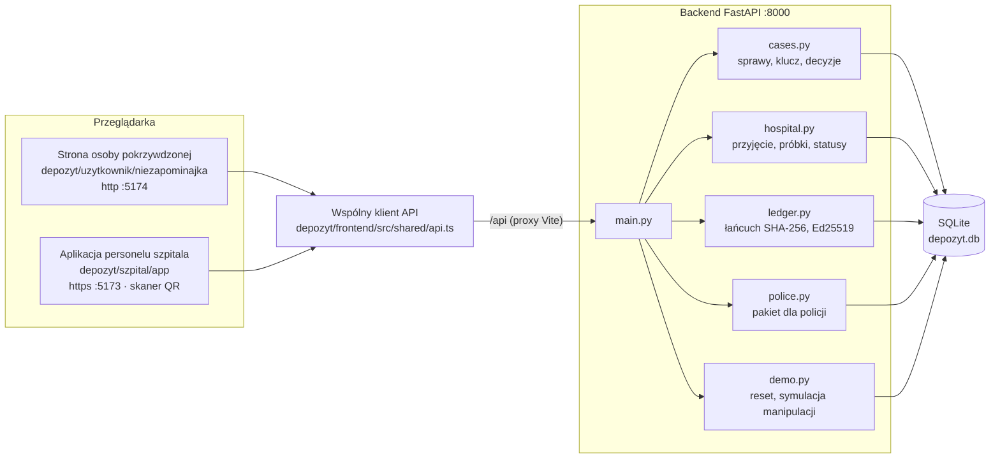
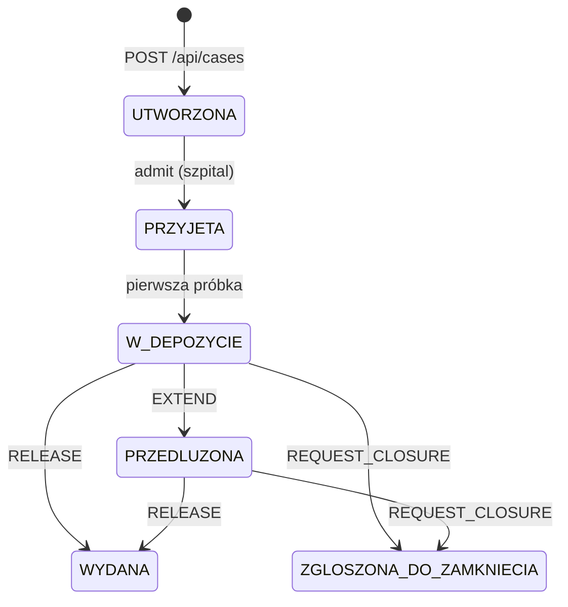
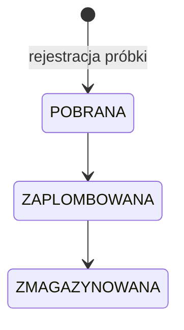

# Architektura

Niezapominajka składa się z jednego backendu w FastAPI i dwóch aplikacji w przeglądarce. Cała logika, od której zależy wiarygodność dowodu, czyli skróty, podpisy i dozwolone zmiany stanu, działa po stronie serwera.



## API

Interaktywna dokumentacja jest pod `http://127.0.0.1:8000/docs`.

| Metoda | Ścieżka | Kto | Wejście | Wynik |
|---|---|---|---|---|
| `POST` | `/api/cases` | osoba pokrzywdzona | `{"origin": "..."}` | `case_id`, `case_key` (klucz pokazywany tylko raz) |
| `GET` | `/api/cases/{case_id}/status` | osoba pokrzywdzona | nagłówek `X-Case-Key` | stan sprawy, terminy, lista próbek |
| `POST` | `/api/cases/{case_id}/decisions` | osoba pokrzywdzona | nagłówek `X-Case-Key`, `{"decision": "RELEASE" \| "EXTEND" \| "REQUEST_CLOSURE"}` | nowy stan i termin; przy `RELEASE` adres pakietu dla policji |
| `POST` | `/api/cases/{case_id}/admit` | personel | `{"staff_id", "hospital_id"}` | stan `PRZYJETA` |
| `POST` | `/api/cases/{case_id}/samples` | personel | `{"staff_id", "type": "WYMAZ" \| "KREW" \| "MOCZ"}` | `sample_id` w formacie `S-XXXX-XXXX`, stan `POBRANA` |
| `POST` | `/api/samples/{sample_id}/events` | personel | `{"staff_id", "event": "ZAPLOMBOWANA" \| "ZMAGAZYNOWANA", "location"}` | nowy stan próbki albo 409 |
| `GET` | `/api/samples/{sample_id}` | personel | | stan, typ, daty próbki |
| `GET` | `/api/samples` | personel | | lista wszystkich próbek |
| `GET` | `/api/ledger/verify?case_id=` | każdy | | wynik weryfikacji łańcucha |
| `GET` | `/api/release/{token}` | policja | token z decyzji `RELEASE` | próbki, dziennik, wynik weryfikacji |
| `POST` | `/api/demo/reset` | demo | | wczytanie `seed/seed.json` od nowa |
| `POST` | `/api/demo/tamper` | demo | `{"case_id", "seq", "field": "location" \| "event" \| "actor_id", "value"}` | podmiana pola wpisu bez przeliczenia skrótu |
| `GET` | `/health` | każdy | | `{"status": "ok", "system": "Depozyt"}` |

Błędne klucze kończą się kodem 403 (odczyt sprawy) albo 401 (decyzja), a niedozwolone przejścia kodem 409 z treścią `{"error": "INVALID_TRANSITION", "message": ...}`.

## Stany sprawy



- Nowa sprawa dostaje termin przechowania 365 dni.
- `EXTEND` przesuwa termin o 180 dni. Można je powtarzać.
- `REQUEST_CLOSURE` ustawia termin na 30 dni od decyzji. Tyle czasu zostaje do zniszczenia próbek.
- `RELEASE` jest dozwolone tylko ze stanów `W_DEPOZYCIE` i `PRZEDLUZONA`. Tworzy token pakietu dla policji.

W prototypie `EXTEND` i `REQUEST_CLOSURE` nie sprawdzają stanu wyjściowego, a terminy są tylko zapisywane: nic nie usuwa spraw automatycznie po ich upływie.

## Stany próbki



Każde inne przejście, na przykład `POBRANA → ZMAGAZYNOWANA`, backend odrzuca:

```json
{"detail": {"error": "INVALID_TRANSITION", "message": "Nie można przejść ze stanu POBRANA do ZMAGAZYNOWANA"}}
```

## Dziennik zdarzeń

Każda sprawa ma własny łańcuch wpisów w tabeli `ledger`. Wpis zawiera pola `case_id`, `seq`, `event`, `sample_id`, `actor_id`, `location`, `ts` i `data`.

```text
hash_0 = "000…0"  (64 zera)
hash_n = SHA-256( hash_{n-1} + "|" + kanoniczny_JSON(wpis_n) )
podpis_n = Ed25519( klucz_prywatny(actor_id), bajty(hash_n) )
```

Kanoniczny JSON ma posortowane klucze i stałe separatory, więc ten sam wpis zawsze daje ten sam skrót.

| Zdarzenie | Kto zapisuje |
|---|---|
| `PRZYJETA` | personel, przy przyjęciu sprawy |
| `POBRANA`, `ZAPLOMBOWANA`, `ZMAGAZYNOWANA` | personel, przy kolejnych etapach próbki |
| `DECISION_EXTEND`, `DECISION_CLOSE`, `DECISION_RELEASE` | `VICTIM`, przy decyzji osoby pokrzywdzonej |
| `UZYSKANO_DOSTEP` | `SYSTEM`, przy otwarciu pakietu przez policję |

`GET /api/ledger/verify` sprawdza po kolei dla każdego wpisu:

1. czy `prev_hash` zgadza się ze skrótem poprzedniego wpisu,
2. czy ponownie policzony skrót zgadza się z zapisanym,
3. czy podpis jest poprawny dla klucza publicznego osoby z tabeli `staff`.

Pierwszy błąd kończy weryfikację: `{"ok": false, "broken_at_seq": 3, "reason": "hash_mismatch"}`. Możliwe przyczyny to `prev_hash_mismatch`, `hash_mismatch` i `signature_invalid`. Miejsce na sprawdzanie przejść stanów (`transition_invalid`) jest przygotowane, ale w prototypie każde przejście jest akceptowane.

### Jak pokazać manipulację

```bash
curl "http://127.0.0.1:8000/api/ledger/verify?case_id=DP-DEMO-01"
# {"ok":true,"broken_at_seq":null,"reason":null}

curl -X POST http://127.0.0.1:8000/api/demo/tamper \
  -H "Content-Type: application/json" \
  -d '{"case_id":"DP-DEMO-01","seq":3,"field":"location","value":"Inne miejsce"}'

curl "http://127.0.0.1:8000/api/ledger/verify?case_id=DP-DEMO-01"
# {"ok":false,"broken_at_seq":3,"reason":"hash_mismatch"}
```

## Model danych

| Tabela | Zawartość |
|---|---|
| `cases` | identyfikator sprawy, skrót SHA-256 klucza, stan, pochodzenie, szpital, data utworzenia, termin przechowania |
| `samples` | identyfikator, sprawa, typ (`WYMAZ`, `KREW`, `MOCZ`), stan, daty utworzenia i zmiany |
| `ledger` | wpisy dziennika ze skrótami i podpisami |
| `staff` | osoby z personelu oraz `VICTIM` i `SYSTEM`, z kluczami Ed25519 |
| `release_tokens` | tokeny pakietów dla policji |
| `anchors`, `signals` | przygotowane pod kotwiczenie dziennika i anonimowe sygnały, jeszcze nieużywane |

Żadna tabela nie zawiera nazwisk osób pokrzywdzonych, danych kontaktowych, danych medycznych ani wyników badań.

## Konfiguracja

- **Porty:** backend 8000, aplikacja szpitala 5173, strona osoby pokrzywdzonej 5174. Vite przydziela porty po kolei, więc aplikację szpitala trzeba uruchomić pierwszą.
- **Proxy:** obie aplikacje przekazują `/api` do `http://127.0.0.1:8000` (`vite.config.js`).
- **HTTPS:** aplikacja szpitala działa przez HTTPS z certyfikatem z `@vitejs/plugin-basic-ssl`, bo przeglądarki udostępniają aparat tylko na `localhost` albo przez HTTPS. Obie aplikacje nasłuchują w sieci lokalnej (`host: true`).
- **Baza:** `depozyt/backend/depozyt.db`, tworzona przy starcie przez `init_db()`. Dane demonstracyjne są w `depozyt/backend/seed/seed.json`, a klucze Ed25519 personelu generują się przy każdym resecie.
- **Zmienne środowiskowe:** plik `.env.example` jest przygotowany na przyszłość, ale prototyp jeszcze go nie odczytuje.
